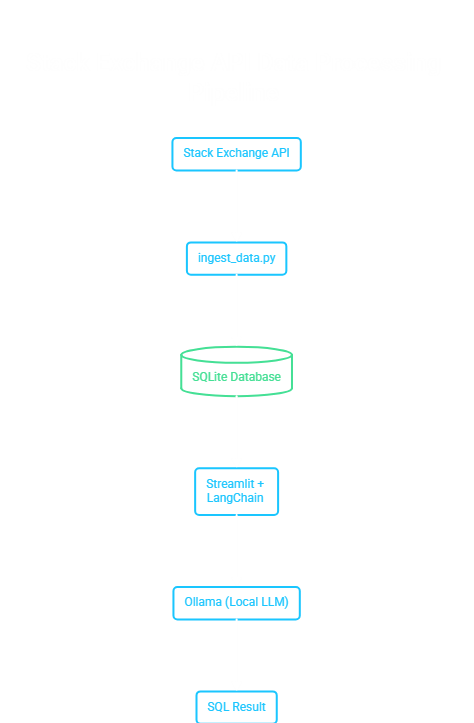

# Stack Overflow Text-to-SQL

A local Text-to-SQL application that converts natural language questions into SQL queries against **live Stack Overflow data**. Data is fetched from the official Stack Exchange API and stored in SQLite for repeated use.

> **Important:** This is a **local-only** project. It uses a local LLM via Ollama and **cannot** be deployed on Streamlit Community Cloud.

---

### Example Query & Result
```text
Your question:
List the most recent 5 questions

Generated SQL:
SELECT * FROM questions WHERE question_id IN (  SELECT question_id   FROM questions   ORDER BY creation_date DESC   LIMIT 5)

Result:
[(80008290, 'BAT file doesn\'t seem to run, but code works on command line', ...)]
```
---

## Features

- Live data ingestion from Stack Overflow API
- Data is stored locally and can be updated anytime
- Natural language to SQL using local Llama model (Ollama)
- Safety guardrails that block dangerous SQL statements
- Clean dark aesthetic interface
- Fully offline after data is ingested and model is downloaded

---

## Architecture


---

## Database Schema

- **users** — `user_id`, `display_name`, `reputation`, `location`, `creation_date`, `last_access_date`
- **questions** — `question_id`, `title`, `body`, `tags`, `score`, `view_count`, `answer_count`, `is_answered`, `owner_user_id`, `creation_date`, `last_activity_date`, `link`
- **answers** — `answer_id`, `question_id`, `body`, `score`, `is_accepted`, `owner_user_id`, `creation_date`, `last_activity_date`

---

## Setup

### 1. Install Ollama
Download from [https://ollama.com](https://ollama.com). Then pull a model (choose one based on your RAM):

```bash
# Recommended for low RAM
ollama pull llama3.2:1b

# Or
ollama pull phi3:mini
```

### 2. Install dependencies
```bash
pip install -r requirements.txt
```

### 3. Ingest live data
```bash
python ingest_data.py
```
This will create `stackoverflow.db` with real Stack Overflow data.

### 4. Run the app
```bash
streamlit run app.py
```

---

## Example Questions

- Who has the highest reputation?
- Show the top 5 questions by view count
- List questions tagged with python
- What is the average score of answers?
- Which user asked the most questions?

---

## Safety Guardrails

The application blocks any query containing:

`DROP`, `DELETE`, `UPDATE`, `INSERT`, `ALTER`, `CREATE`, `TRUNCATE`, `REPLACE`, `ATTACH`, `DETACH`, `PRAGMA`

Only read-only queries are allowed.

---

## Updating the Data

Simply re-run:

```bash
python ingest_data.py
```

Existing records are updated and new ones are added.

---

## Notes

- This project is designed for **local execution only**.
- Other users can clone and run it on their own machine after installing Ollama and pulling a model.
- The database file (`stackoverflow.db`) is intentionally excluded from the repository because it is large and can be regenerated.

---

## Tech Stack

- Python
- Streamlit
- LangChain
- Ollama (Local LLM)
- SQLite
- Stack Exchange API
  
---
# Stack-Overflow-Text-to-SQL
A local Text-to-SQL application that converts natural language questions into SQL queries against (ive Stack Overflow data).  Data is fetched from the official Stack Exchange API and stored in SQLite for repeated use.

